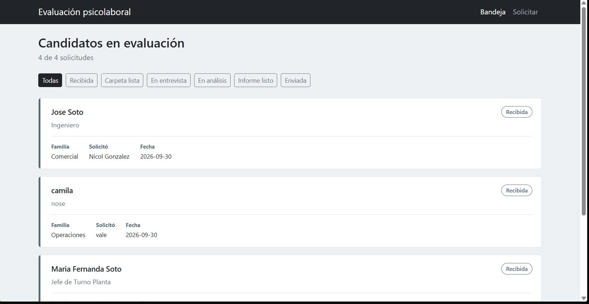
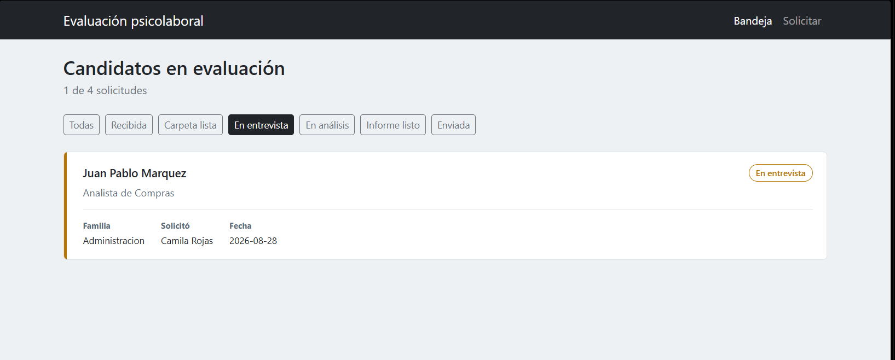
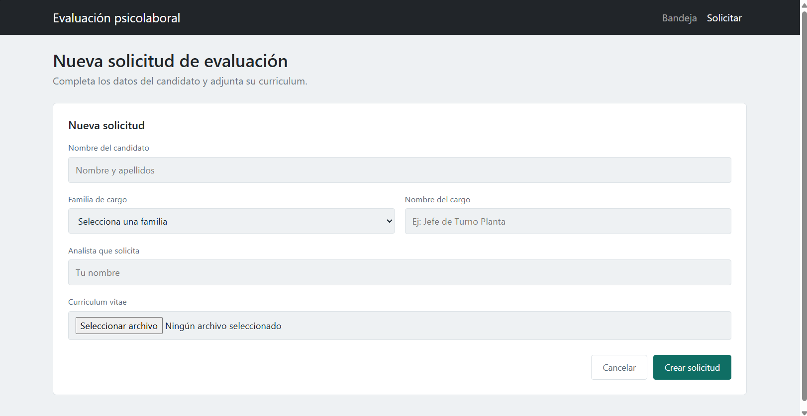
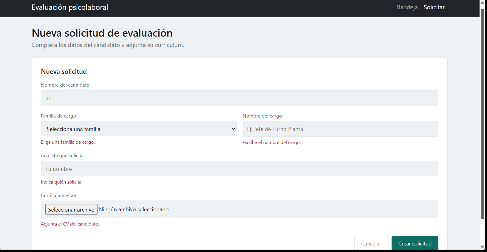
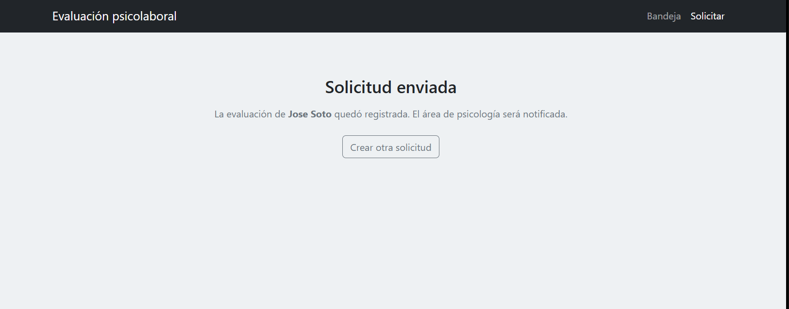
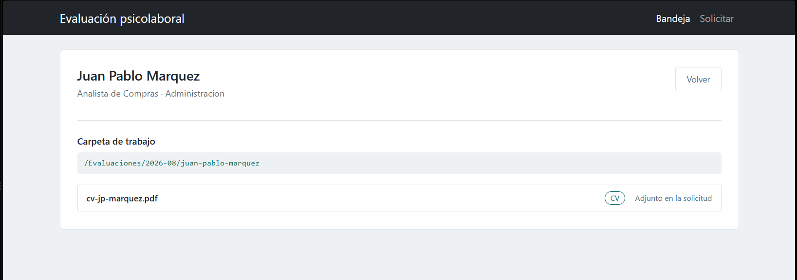
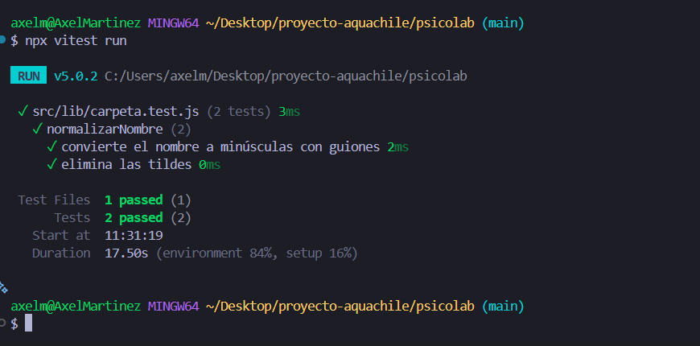
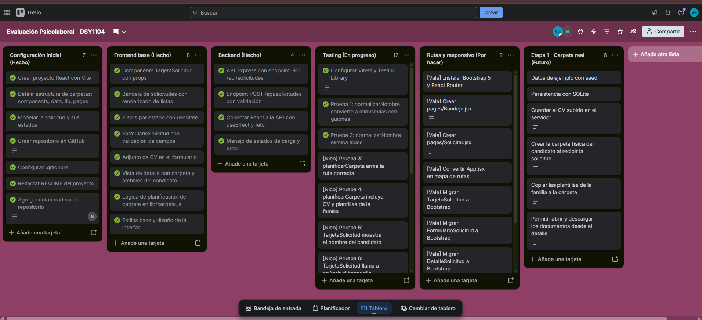

# Sistema de evaluación psicolaboral

Automatización del proceso de evaluación psicolaboral del área de
Reclutamiento y Selección. Proyecto DSY1104 - Desarrollo Fullstack II.

## Equipo

- Valentina Santana
- Nicol González

## Problema

El proceso actual contiene múltiples tareas manuales repetitivas: crear la
carpeta del candidato, descargar el CV, copiar las plantillas según la
familia de cargo, y traspasar a mano el análisis al informe en Excel.

## Alcance de esta entrega

Funcionando:

- Bandeja de candidatos con filtro por estado
- Formulario de solicitud con validación y adjunto de CV
- Vista de detalle con la carpeta y archivos que el sistema prepara
- Navegación entre vistas con React Router
- Diseño responsivo con Bootstrap 5
- API REST con endpoints para listar y crear solicitudes
- Entorno de pruebas unitarias con Vitest

Pendiente:

- Completar las pruebas unitarias
- Persistencia en base de datos
- Creación real de carpetas y documentos
- Etapa 2: generación automática del informe
- Etapa 3: asistente de entrevista

## Tecnologías

- React 19 con Vite
- React Router
- Bootstrap 5
- Node.js con Express
- Vitest y React Testing Library

## Cómo ejecutarlo

Requiere Node.js 18 o superior y dos terminales.

Backend:

    cd api
    npm install
    npm run dev

Frontend:

    cd psicolab
    npm install
    npm run dev

La aplicación queda disponible en http://localhost:5173

## Pruebas

    cd psicolab
    npx vitest run

## Estructura

    api/                 Servidor Express
    psicolab/            Aplicación React
      src/
        components/      Componentes reutilizables
        pages/           Vistas enrutadas
        data/            Catálogos y estados
        lib/             Lógica de negocio y llamadas a la API
        test/            Configuración del entorno de pruebas
    docs/capturas/       Evidencia visual del avance

## Capturas del avance

### Bandeja de candidatos

### Filtro por estado

### Formulario de solicitud

### Validación de campos

### Confirmación de envío

### Detalle del candidato

### Pruebas unitarias

### Gestión del proyecto

## Gestión del proyecto

Tablero Trello: https://trello.com/b/Xe9VZZSP/evaluacion-psicolaboral-dsy1104